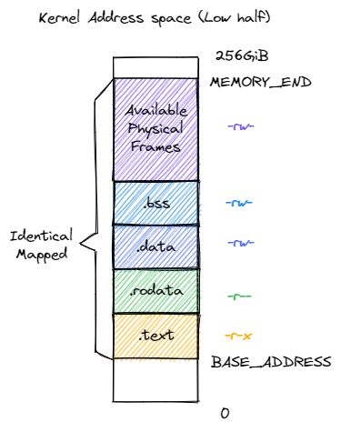

## Kernel Report

kernel memory layout:

<table><tr>
<td></td>
<td></td>
</tr></table>


application memory layout:


- Bootloader

  - entry:

    将kernel代码放在qemu指定物理地址(0x80000000)后, 先设置好sp就直接跳转到start函数

    ```asm
    _start:
        la sp, boot_stack_top
        call start
    ```

    start函数负责一些初始化(内存访问权限设置, mret后权限态为S-mode等), 接下来就进入了rust_main()

    ```rust
    pub fn start() {
    // set M Exception Program Counter to main, for mret.
      unsafe { 
        mstatus::set_mpp(MPP::Supervisor); 
        mtvec::write(strap_handler as usize, TrapMode::Direct);
      }
      mepc::write(rust_main as usize);
      unsafe {
        asm!("csrw mideleg,    {}", in(reg) !0);
        asm!("csrw medeleg,    {}", in(reg) !0);
      }
      unsafe {
        sie::set_ssoft();   // SSIE
        sie::set_stimer();  // STIE
        sie::set_sext();    // SEIE
      }

      timer_init();
      set_pmp();
      Console::console_init(UART_BASE_ADDRESS);
      
      println!("hart id = {}", hart_id());

      unsafe { asm!("mret"); }
    }
    ```

- 内存初始化:

  - 物理页分配器的初始化: 实现了一个FrameAllocator(本质是一个manage empty pages的队列)
    ```rust
    trait FrameAllocator {
      fn new() -> Self;
      fn alloc(&mut self) -> Option<PhysPageNum>;
      fn dealloc(&mut self, ppn: PhysPageNum);
    }
    ```
  - 分配与释放:
    alloc: 直接调用`alloc()`函数即可
    drop: 
    ```rust
    pub struct FrameTracker {
      pub ppn: PhysPageNum
    }

    impl Drop for FrameTracker {
      fn drop(&mut self) {
        frame_dealloc(self.ppn);   
      }
    }
    ```
- 内存管理:
  - 页表的创建:
    kernel的page table每次会申请一个frame来作为基地址, 大作业中采用的SV39标准的三级页表
    ```rust
    pub struct PageTable {
      root_ppn: PhysPageNum,
      frames: Vec<FrameTracker>
    }
    ```
    > frames 以 FrameTracker 的形式保存了页表所有的节点（包括根节点）所在的物理页帧。这与物理页帧管理模块的测试程序是一个思路，即将这些 FrameTracker 的生命周期进一步绑定到 PageTable 下面。当 PageTable 生命周期结束后，向量 frames 里面的那些 FrameTracker 也会被回收，也就意味着存放多级页表节点的那些物理页帧被回收了。
  - 页表分配, 查找, 释放:
    - 分配:
    for循环模拟的是三级页表查询, 如果不存在某个页表项就直接创建
    ```rust
    /// find PTE, if page table doesn't exists, then create one.
    fn find_pte_create(&mut self, vpn: VirtPageNum) -> Option<&mut PageTableEntry> {
      let idxs = vpn.indexes();
      let mut base_ppn = self.root_ppn;
      let mut result: Option<&mut PageTableEntry> = None;
      for (i, &idx) in idxs.iter().enumerate() {
        let pte = &mut base_ppn.get_pte_array()[idx];
        if i == 2 {
          result = Some(pte);
          break;
        } 
        if !pte.is_valid() {
          let frame = frame_alloc().unwrap();
          *pte = PageTableEntry::new(frame.ppn, PTEFlags::V); // declare it as valid
          self.frames.push(frame);
        }
        base_ppn = pte.ppn();
      }
      result
    }
    ```
    - 查找: 和分配基本一致, 唯一区别在于发现不存在页表项就返回`None`而不是创建它
    - 释放: 找到对应页, 将其设为invalid即可:
    ```rust
    /// set a virtual page as invalid
    pub fn unmap(&mut self, vpn: VirtPageNum) {
      let pte = self.find_pte(vpn).unwrap();
      assert!(pte.is_valid(), "vpn {:?} is invalid before mapping", vpn);
      *pte = PageTableEntry::empty();
    }
    ```
  - 物理内存管理器:
    实现的是Buddy算法, 大致做法为一开始将一段内存空间作为heap, 每次需要创建或者释放的时候就`alloc/dealloc`.
    由于rust的特性, 我们只需要实现对应的函数即可:
    ```rust
    #[global_allocator]
    /// heap allocator instance
    static HEAP_ALLOCATOR: LockedHeap::<32> = LockedHeap::empty();
    static mut HEAP_SPACE: [u8; KERNEL_HEAP_SIZE] = [0; KERNEL_HEAP_SIZE];

    /// corresponding function:
    unsafe fn alloc(&self, layout: Layout) -> *mut u8;

    unsafe fn dealloc(&self, ptr: *mut u8, layout: Layout);
    ```

- IO 相关
  qemu `-machine virt`: 1 NS16550 compatible UART
  直接使用`uart_16550`这个crate提供的函数即可:
  - getchar/ putchar:
    ```rust
    #[inline]
    fn put_char(&self, c: u8) {
      unsafe { UART.lock().assume_init_mut() }.send(c);
    }

    #[inline]
    fn put_str(&self, s: &str) {
      let mut uart = UART.lock();
      let uart = unsafe { uart.assume_init_mut() };
      for c in s.bytes() {
        uart.send(c);
      }
    }

    #[inline]
    fn get_char(&self) -> usize {
      let mut uart = UART.lock();
      let uart = unsafe { uart.assume_init_mut() };
      uart.receive() as usize
    }
    ```
- 进程加载:
  - ELF parser使用的是`xmas_elf`相关的操作
  - 从file system中加载进来相关elf file data, 并load相关内存(**包括trampoline 和上下文切换时要保存的context**):
  ```rust
  /// In user address space: create trampoline, trapContext and userStack,
  /// 
  /// also returns user_stack_pointer and its entry_point
  pub fn from_elf(elf_data: &[u8]) -> (Self, usize, usize, usize) {
    let mut memory_set = Self::new_bare();
    memory_set.map_trampoline();
    let elf = xmas_elf::ElfFile::new(elf_data).unwrap();
    ...
    for i in 0..ph_count {
      if ph.get_type().unwrap() == xmas_elf::program::Type::Load {
        ...
        memory_set.push(
          map_area, 
          Some(&elf.input[ph.offset() as usize .. (ph.offset() + ph.file_size()) as usize])
        );
      }
    }
    ...
    user_stack_bottom = max(user_stack_bottom, USER_STACK_TOP - USER_STACK_SIZE);
    let user_stack_top: usize = USER_STACK_TOP;

    memory_set.push(
      MapArea::new(
        user_stack_bottom.into(),
        user_stack_top.into(),
        MapType::Framed,
        MapPermission::R | MapPermission::W | MapPermission:: U,
      ),
      None
    );

    memory_set.push(
      MapArea::new(
        TRAP_CONTEXT.into(), 
        TRAMPOLINE.into(), 
        MapType::Framed, 
        MapPermission::R | MapPermission::W
      ),
      None
    );
    (memory_set, user_stack_bottom, user_stack_top, elf.header.pt2.entry_point() as usize)
  }
  ```
- 调度
  - 上下文切换:
  将trampoline, trap_context映射到内存地址的最高8k(4k+4k), 上下文切换时只需将相关的寄存器, 页表切换即可:
  ```asm
  .altmacro
  .macro SAVE_GP n
      sd x\n, \n*8(sp)
  .endm
  .macro LOAD_GP n
      ld x\n, \n*8(sp)
  .endm
      .section .text.trampoline
      .globl __alltraps
      .globl __restore
      .align 2
  __alltraps:
      csrrw sp, sscratch, sp
      # now sp->*TrapContext in user space, sscratch->user stack
      # save other general purpose registers
      sd x1, 1*8(sp)
      # skip sp(x2), we will save it later
      sd x3, 3*8(sp)
      # skip tp(x4), application does not use it
      # save x5~x31
      .set n, 5
      .rept 27
          SAVE_GP %n
          .set n, n+1
      .endr
      # we can use t0/t1/t2 freely, because they have been saved in TrapContext
      csrr t0, sstatus
      csrr t1, sepc
      sd t0, 32*8(sp)
      sd t1, 33*8(sp)
      # read user stack from sscratch and save it in TrapContext
      csrr t2, sscratch
      sd t2, 2*8(sp)
      # load kernel_satp into t0
      ld t0, 34*8(sp)
      # load trap_handler into t1
      ld t1, 36*8(sp)
      # move to kernel_sp
      ld sp, 35*8(sp)
      # switch to kernel space
      csrw satp, t0
      sfence.vma
      # jump to trap_handler
      jr t1

  __restore:
      # a0: *TrapContext in user space(Constant); a1: user space token
      # switch to user space
      csrw satp, a1
      sfence.vma
      csrw sscratch, a0
      mv sp, a0
      # now sp points to TrapContext in user space, start restoring based on it
      # restore sstatus/sepc
      ld t0, 32*8(sp)
      ld t1, 33*8(sp)
      csrw sstatus, t0
      csrw sepc, t1
      # restore general purpose registers except x0/sp/tp
      ld x1, 1*8(sp)
      ld x3, 3*8(sp)
      .set n, 5
      .rept 27
          LOAD_GP %n
          .set n, n+1
      .endr
      # back to user stack
      ld sp, 2*8(sp)
      sret

  ```
  - 调度策略: 轮询

  用`TaskManager`维护当前可运行的Process (本质上是个队列):
  ```rust
  pub struct TaskManager {
    ready_queue: VecDeque<Arc<TaskControlBlock>>
  }

  /// Current Schedule Strategy: Round-Robin
  impl TaskManager {
    pub fn new() -> Self {
      Self { ready_queue: VecDeque::new() }
    }

    /// Add a task to `TaskManager`
    pub fn add(&mut self, task: Arc<TaskControlBlock>) {
      self.ready_queue.push_back(task);
    }

    ///Remove the first task and return it, or `None if `TaskManager` is empty 
    pub fn fetch(&mut self) -> Option<Arc<TaskControlBlock>> {
      self.ready_queue.pop_front()
    }
  }
  ```

  轮询时只需要每次从队头取出一个Task进行上下文切换并执行即可:
  ```rust
  ///The main part of process execution and scheduling
  ///Loop `fetch_task` to get the process that needs to run, and switch the process through `__switch`
  pub fn run_tasks() {
    loop {
      let mut processor = PROCESSOR.exclusive_access();
      if let Some(task) = fetch_task() {
        // find a task ready to run
        let idle_task_cx_ptr = processor.get_idle_task_cx();
        let mut task_inner = task.inner_exclusive_access();
        let next_task_cx_ptr = &task_inner.task_cx as *const TaskContext;
        task_inner.task_status = TaskStatus::Running;
        drop(task_inner); // release coming task TCB manually
        processor.current = Some(task);
        drop(processor); // release processor manually
        unsafe {
          __switch(idle_task_cx_ptr, next_task_cx_ptr)
        }
      }
    }
  }
  ```

- 中断

  - 中断流程: 
    在从S-mode返回U-mode的时候, 设置好stvec指向Trampoline的地址, 并恢复对应的通用寄存器与satp等:

    *Trampoline的代码负责保存上下文, 并且跳转至trap_handler()

    > 为何我们在 __restore 中需要借助寄存器 jr 而不能直接 call __restore
    > 因为在内存布局中，这条 .text.trampoline 段中的跳转指令和 trap_handler 都在代码段之内，汇编器（Assembler）和链接器（Linker）会根据 linker-qemu/k210.ld 的地址布局描述，设定跳转指令的地址，并计算二者地址偏移量，让跳转指令的实际效果为当前 pc 自增这个偏移量。但实际上由于我们设计的缘故，这条跳转指令在被执行的时候，它的虚拟地址被操作系统内核设置在地址空间中的最高页面之内，所以加上这个偏移量并不能正确的得到 trap_handler 的入口地址。

  ```rust
  fn set_user_trap_entry() {
    unsafe {
      stvec::write(TRAMPOLINE, TrapMode::Direct);
    }
  }

  #[no_mangle]
  pub fn trap_return() -> ! {
    // set user trap entry so that next time a trap happens, 
    // stvec will point to the trampoline.
    set_user_trap_entry();
    let trap_cx_ptr = TRAP_CONTEXT;
    let user_satp = current_user_token();
    extern "C" {
      fn __alltraps();
      fn __restore();
    }
    let restore_va = __restore as usize - __alltraps as usize + TRAMPOLINE;
    unsafe {
      asm!(
        "fence.i",                      // clear the cache
        "jr {restore_va}",              // jump to new addr of __restore asm function
        restore_va = in(reg) restore_va,
        in("a0") trap_cx_ptr,      // a0 = virt addr of Trap Context
        in("a1") user_satp,        // a1 = phy addr of usr page table
        options(noreturn)
      );
    }
  }
  ```

  - syscall implementations:
    - fork: 复制一份和父进程一样的地址空间
      父进程的返回值在trap_handler()时才设置, 而子进程在sys_fork()直接设置为0
    ```rust
    pub fn fork(self: &Arc<Self>) -> Arc<Self> { 
      let mut parent_inner = self.inner.exclusive_access();
      
      let memory_set = MemorySet::from_existed_user(&parent_inner.memory_set);
      let trap_cx_ppn = memory_set
        .translate(VirtAddr::from(TRAP_CONTEXT).into())
        .unwrap()
        .ppn();
      let pid_handler = pid_alloc();
      let kernel_stack = KernelStack::new(&pid_handler);
      let kernel_stack_top = kernel_stack.get_top();

      ...
      let task_control_block = Arc::new(TaskControlBlock {
        pid: pid_handler,
        kernel_stack,
        inner: unsafe {
          UPSafeCell::new(TaskControlBlockInner {
            task_status: parent_inner.task_status, 
            memory_set,
            user_stack_bottom: parent_inner.user_stack_bottom,
            task_cx: TaskContext::goto_trap_return(kernel_stack_top),
            trap_cx_ppn,
            base_size: parent_inner.base_size,
            fd_table: fd_copy,
            parent: Some(Arc::downgrade(self)),
            children: Vec::new(),
            exit_code: 0,
        })},
      });

      parent_inner.children.push(task_control_block.clone());
      let trap_cx = task_control_block.inner_exclusive_access().get_trap_cx();
      trap_cx.kernel_sp = kernel_stack_top;

      task_control_block
    } 
    
    pub fn sys_fork() -> isize {
      let current_task = current_task().unwrap();
      let new_task = current_task.fork();
      let new_pid = new_task.pid.0;

      let new_trap_cx = new_task.inner_exclusive_access().get_trap_cx();
      new_trap_cx.x[10] = 0; // set the return value of child proc as 0

      add_task(new_task);
      new_pid as isize
    }
    ```
    - exec: 使得一个进程能够加载一个新应用的 ELF 可执行文件中的代码和数据替换原有的应用地址空间中的内容，并开始执行。
    
    ```rust
    pub fn exec(&self, elf_data: &[u8]) {
      let (memory_set, user_sp_bottom, user_sp, entry_point) = MemorySet::from_elf(elf_data);
      let trap_cx_ppn = memory_set
        .translate(VirtAddr::from(TRAP_CONTEXT).into())
        .unwrap()
        .ppn();
    
      let mut inner = self.inner_exclusive_access();
      // update PCB's info
      inner.memory_set = memory_set;
      inner.user_stack_bottom = VirtAddr::from(user_sp_bottom).floor();

      inner.trap_cx_ppn = trap_cx_ppn;
      inner.base_size = user_sp;
      let trap_cx = inner.get_trap_cx();
      *trap_cx = TrapContext::app_init_context(
        entry_point, 
        user_sp, 
        KERNEL_SPACE.exclusive_access().token(),
        self.kernel_stack.get_top(), 
        trap_handler as usize
      );
    }

    pub fn sys_exec(path_ptr: *const u8) -> isize {
      let token = current_user_token();
      let path = translated_str(token, path_ptr);
      // println!("{} {}", current_task().unwrap().pid.0, path);

      if let Some(file) = open_file(path.as_str(), Flags::RDONLY) {
        // println!("{} {}", current_task().unwrap().pid.0, path);
        let task = current_task().unwrap();
        task.exec(file.read_all().as_slice());
        0
      } else {
        -1
      }
    }
    ```
    - exit:
    ```rust
    /// exit current task
    pub fn sys_exit(exit_code: i32) -> ! {
      println!("[kernel] Application exited with code {}", exit_code);
      exit_current_and_run_next(exit_code);
    }

    pub fn exit_current_and_run_next(exit_code: i32) {
      let task = take_current_task().unwrap();

      let pid = task.getpid();
      if pid == IDLE_PID {
        println!(
          "[kernel] Idle process exit with exit_code {} ...",
          exit_code
        );
        if exit_code != 0 {
          crate::board::QEMU_EXIT_HANDLE.exit_failure();
        } else {
          crate::board::QEMU_EXIT_HANDLE.exit_success();
        }
      }

      let mut task_inner = task.inner_exclusive_access();
      task_inner.task_status = TaskStatus::Zombie;
      task_inner.exit_code = exit_code;

      { // link zombie proc's childer to `initproc`
        let mut initproc_inner = INITPROC.inner_exclusive_access();
        for child in task_inner.children.iter() {
          child.inner_exclusive_access().parent = Some(Arc::downgrade(&INITPROC));
          initproc_inner.children.push(child.clone());
        }
      }

      task_inner.children.clear();
      task_inner.memory_set.recycle_data_pages();
      drop(task_inner);
      drop(task);

      let mut _unused = TaskContext::zero_init();
      schedule(&mut _unused as *mut TaskContext);
    }
    ```
    - 其他syscall
    ```rust
    /// give up current running task and yield
    pub fn sys_yield() -> isize {
      suspend_current_and_run_next();
      0
    }

    /// get current time
    pub fn sys_get_time() -> isize {
      get_time_ms() as isize
    }

    pub fn sys_getpid() -> isize {
      current_task().unwrap().pid.0 as isize
    }

    /// Return -1 if no child proc (pid = -1) or no corresponding child proc (pid != -1)
    /// Return -2 if the candidate proc is still not `Zombie`
    pub fn sys_waitpid(pid: isize, exit_status: *mut i32) -> isize {
      let task = current_task().unwrap();

      // println!("[kernel] waiter pid {} waitee pid {}", task.getpid(), pid);
      let mut inner = task.inner_exclusive_access();
      if !inner
        .children
        .iter()
        .any(|child| pid == -1 || child.getpid() == pid as usize) {
          return -1;
      }
      let pair = inner
        .children
        .iter()
        .enumerate()
        .find(|(_, p)| {
          p.inner_exclusive_access().is_zombie() && (pid == -1 || p.getpid() == pid as usize)
      });

      if let Some((idx, _)) = pair {
        let child = inner.children.remove(idx);
        assert_eq!(Arc::strong_count(&child), 1);
        let found_pid = child.getpid();
        let exit_code = child.inner_exclusive_access().exit_code;
        *translated_refmut(inner.get_user_token(), exit_status) = exit_code;
        found_pid as isize 
      } else {
        -2 // not a zombie proc
      }
    }
    ```
- 用户态相关
  - 切换回用户态:
  ```asm
  __restore:
    # a0: *TrapContext in user space(Constant); a1: user space token
    # switch to user space
    csrw satp, a1
    sfence.vma
    csrw sscratch, a0
    mv sp, a0
    # now sp points to TrapContext in user space, start restoring based on it
    # restore sstatus/sepc
    ld t0, 32*8(sp)
    ld t1, 33*8(sp)
    csrw sstatus, t0
    csrw sepc, t1
    # restore general purpose registers except x0/sp/tp
    ld x1, 1*8(sp)
    ld x3, 3*8(sp)
    .set n, 5
    .rept 27
        LOAD_GP %n
        .set n, n+1
    .endr
    # back to user stack
    ld sp, 2*8(sp)
    sret
  ```
  - 简单用户态应用:
    - bash
    ```rust
    pub fn main() -> i32 {
      println!("User Shell:");
      let mut line: String = String::new();
      print!("$ ");
      loop {
        let c = getchar();
        match c {
          LF | CR => {
            println!("");
            if !line.is_empty() {
              line.push('\0');
              let pid = fork();
              if pid == 0 {
                if exec(line.as_str()) == -1 {
                  println!("Error when execve(\"{}\")", line);
                  return -4;
                }
                unreachable!();
              } else {
                let mut exit_code: i32 = 0;
                let exit_pid = waitpid(pid as usize, &mut exit_code);
                assert_eq!(exit_pid, pid);
                println!("Shell: Process {} exited with code {}", pid, exit_code);
              }
              line.clear();
            }
            print!("$ ");
          } 
          BS | DEL => {
            if !line.is_empty() {
              print!("{}", BS as char);
              print!(" ");
              print!("{}", BS as char);
              line.pop();
            }
          }
          _ => {
            print!("{}", c as char);
            line.push(c as char);
          }
        }
      }
    }
    ```
- 关机
  根据qemu规定往对应地址(0x100000) 上写即可shutdown
  ```rust
  impl QEMUExit for RISCV64 {
    /// Exit qemu with specified exit code.
    #[no_mangle]
    fn exit(&self, code: u32) -> ! {
        // If code is not a special value, we need to encode it with EXIT_FAILURE_FLAG.
        let code_new = match code {
            EXIT_SUCCESS | EXIT_FAILURE | EXIT_RESET => code,
            _ => exit_code_encode(code),
        };

        // println!("stvec: {:#x}", stvec::read().address());
        unsafe {
            asm!(
                "sw {0}, 0({1})",
                in(reg)code_new, in(reg)self.addr
            );

            // For the case that the QEMU exit attempt did not work, transition into an infinite
            // loop. Calling `panic!()` here is unfeasible, since there is a good chance
            // this function here is the last expression in the `panic!()` handler
            // itself. This prevents a possible infinite loop.
            loop {
                asm!("wfi", options(nomem, nostack));
            }
        }
    }

    fn exit_success(&self) -> ! {
        self.exit(EXIT_SUCCESS);
    }

    fn exit_failure(&self) -> ! {
        self.exit(EXIT_FAILURE);
    }
  }

  ```
- 文件系统 toy File System 
  

  - Block device:
  ```rust
  pub trait BlockDevice: Send + Sync + Any {
    /// read from block data to `buf`
    fn read_block(&self, block_id: usize, buf: &mut [u8]);  
    
    /// write data back to block
    fn write_block(&self, block_id: usize, buf: &[u8]);
  }
  ```
  - Block Cache: 
  维护16个BlockCache entry, 每个entry大小为512B, 用时记录是否dirty
  ```rust
  const BLOCK_CACHE_SIZE: usize = 16;

  pub struct BlockCache {
    /// cached block data
    cache: [u8; BLOCK_SZ],
    /// corresponding block id
    block_id: usize, 
    /// corresponding block device
    block_device: Arc<dyn BlockDevice>,
    /// dirty bit 
    modified: bool,
  }

  pub struct BlockCacheManager {
    queue: VecDeque<(usize, Arc<Mutex<BlockCache>>)>
  }
  ```
  - Superblock: recording metadata
  ```rust
  pub struct SuperBlock {
    magic: u32,
    pub total_blocks: u32,
    pub inode_bitmap_blocks: u32,
    pub inode_area_blocks: u32,
    pub data_bitmap_blocks: u32,
    pub data_area_blocks: u32,
  }
  ```
  - BitMap:

  记录共有多少blocks(每个大小为512 * 8 bit)
  ```rust
  pub struct Bitmap {
    start_block_id: usize, 
    blocks: usize, // total block number
  }

  impl Bitmap {
    /// returns index of an avaliable empty block
    pub fn alloc(&self, block_dev: &Arc<dyn BlockDevice>) -> Option<usize>;

    /// Deallocate a block's index
    pub fn dealloc(&self, block_dev: &Arc<dyn BlockDevice>, bit: usize);
  }
  ```
  - Inode:
  ```rust
  const INODE_DIRECT_COUNT: usize = 28;

  #[repr(C)]
  pub struct DiskInode {
      pub size: u32,
      pub direct: [u32; INODE_DIRECT_COUNT],
      pub indirect1: u32,
      pub indirect2: u32,
      type_: DiskInodeType,
  }

  #[derive(PartialEq)]
  pub enum DiskInodeType {
      File,
      Directory
  }
  ```

  - FileSystem:
  ```rust
  pub struct FileSystem {
    pub block_dev: Arc<dyn BlockDevice>,
    pub inode_bitmap: Bitmap,
    pub data_bitmap: Bitmap,

    inode_area_start_block: u32,
    data_area_start_block: u32,
  }

  impl FileSystem {
    pub fn create(
      block_dev: Arc<dyn BlockDevice>,
      total_blks: u32,
      inode_bitmap_blks: u32,
    ) -> Arc<Mutex<Self>>;
      

    /// Open a block device as a filesystem
    pub fn open(block_dev: Arc<dyn BlockDevice>) -> Arc<Mutex<Self>>;

    pub fn alloc_inode(&mut self) -> u32;

    pub fn dealloc_inode(&mut self, inode_id: usize);

    /// available data_block's id in the device's layout
    pub fn alloc_data(&mut self) -> u32;

    pub fn dealloc_data(&mut self, data_id: usize);
  }

  ```

  - VFS:
  ```rust
  // Different from `DiskInode`, `Inode` is stored in Memory
  pub struct Inode {
    block_id: usize,            // corresponding block id
    block_offset: usize,        // inode's offset within the block
    fs: Arc<Mutex<FileSystem>>, // operations are achieved through `FileSystem`
    block_dev: Arc<dyn BlockDevice>,
  }

  impl Inode {

    /// create a vfs node
    pub fn new(
      block_id: usize,
      block_offset: usize,
      fs: Arc<Mutex<FileSystem>>,
      block_dev: Arc<dyn BlockDevice>,
    ) -> Self;

    fn read_disk_inode<V>(&self, f: impl FnOnce(&DiskInode) -> V) -> V;

    fn modify_disk_inode<V>(&self, f: impl FnOnce(&mut DiskInode) -> V) -> V;

    /// find inode by its name
    pub fn find_name(&self, name: &str) -> Option<Arc<Inode>>;

    fn find_inode_id(&self, name: &str, disk_inode: &DiskInode) -> Option<u32>;

    /// Increase the size of disk inode
    fn increase_size(
      &self, 
      new_size: u32, 
      disk_inode: &mut DiskInode,
      fs: &mut MutexGuard<FileSystem>
    );

    /// Create an Inode(file) at '/'
    pub fn create(&self, name: &str) -> Option<Arc<Inode>>;

    /// list inodes under current inode
    pub fn ls(&self) -> Vec<String>;

    pub fn read_at(&self, offset: usize, buf: &mut [u8]) -> usize;

    /// write `buf` to the file
    pub fn write_at(&self, offset: usize, buf: &[u8]) -> usize;

    /// Clear the data in current inode but remains the inode
    pub fn clear(&self);
  }
  ```

其他相关函数:

```rust
pub fn putchar(c: u8) {
	// write(STDOUT, &[c]);
	print!("{}", c as char);
}

pub fn getchar() -> u8 {
	let c = [0u8; 1];
	read(STDIN, &c);
	c[0]
}


#[inline]
pub fn isdigit(ch: u8) -> bool {
	ch >= b'0' && ch <= b'9'
}

pub fn getint() -> isize {
	let mut c = getchar();
	let mut ret: isize = 0;
	let mut f: isize = 1;

	while !isdigit(c) {
		// println!("{}# read", c as char);
		if c == b'-' {
			f = -1;
		}
		c = getchar();
	}

  while isdigit(c) {
    ret = ret * 10 + (c as isize - b'0' as isize);
    c = getchar();
	}
	ret * f
}
```

效果展示:

执行相关fork, exec, exit, yield操作:


执行putchar, getchar操作:

